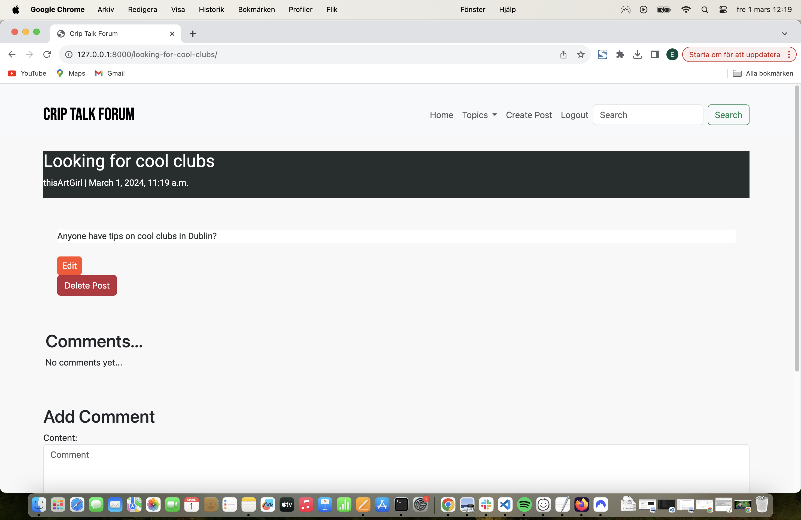
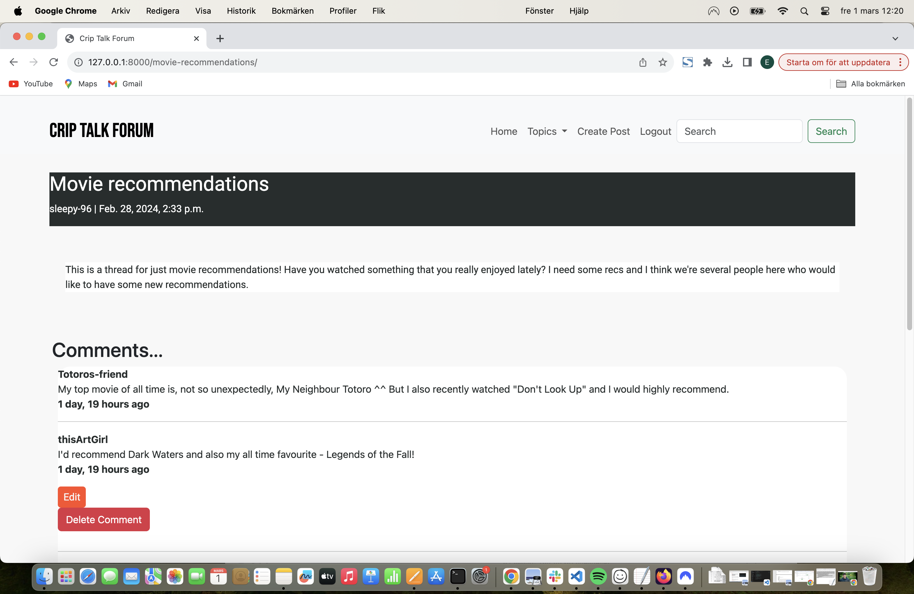

# Introduction

Crip Talk is a forum website created by and for people with disabilities where we can have a space for everything in life with the added spice of everyone having a disabled perspective. There is, of course, no way to monitor whether or not each user actually has a disability but that is less important as the main point is to create a digital space designated to the crip community. The most important thing is that everyone follows the forum community guidelines which is easier to monitor.

# Table of Contents
* [User experience (UX)](#user-experience-ux)
* [Features](#features)
    * [Homepage and Navbar](#homepage-and-navbar)
    * [Sign Up](#signup)
    * [Login Page](#login-page)
    * [Create Post](#create-post)
    * [Topic pages](#topic-pages)    
    * [Add comment](#add-comment)
    * [Search Bar](#search-bar)
    * [Admin Panel](#admin-panel)
    * [Future features](#future-features)
* [Design](#design)
    * [Database Models](#database-models)
    * [Colour Scheme](#colour-scheme)
    * [Fonts](#fonts)
    * [Wireframes](#wireframes)
    * [Accessibility](#accessibility)
* [Technologies Used](#technologies-used)
* [Deployment](#deployment)
* [Testing](#testing)
* [Credits](#credits)

# User Experience (UX)
To plan and produce this project, I used an agile methodology. I used the project tool in GitHub to keep track of the different processes to produce functions that the website needed to have. You can find the project [here](https://github.com/users/e-tidemo/projects/4).

I missed the Epics (GitHub Milestones) as I was working on the project. These can add an overall theme to a group of user stories and would have been useful in the process of creating this project. I will look into this more and use Epics in future projects. 

The picture below is the Kanban board of my project.

The user stories were also mapped up in the document below. Because of some limitations in time, I needed to create some system of priority and decided to categorise all user stories as "must have", "should have" or "could have". As is evident in the image below, I did not manage to find time to finish two of the user stories which I have categorised as "could have". These have, instead, been brought up in the [Future Features](##future-features) section below.

# Features
The features of the website were determined, as I mentioned above, largely by the limitations in time since this affected which features were implemented. I started with the must haves and then moved on to the should haves and could haves. The structure was planned to have at minimum a home page, at least 4 different categories of topics to sort forum threads into, a sign up page, a page for creating posts to start a thread, a functioning navigation bar, a login page and a logout button. Then I added some extra features such as a search bar and a search-results page. These are presented in a different order below:

### Homepage and Navbar
![homepage]

### Sign Up

### Login Page

### Create Post 

And the finished post:

### Edit and Delete Posts and Comments

### Topic Pages

### Add comment

And the comment posted:

### Search bar

For testing of these features and the website as a whole, see [TESTING.md](TESTING.md).

### Admin panel

Only the administrator can log in.

The administrator can delete posts or comments.

The administrator can also edit posts and comments.

If necessary, the administrator can also delete user accounts.

## Future Features
Due to limitations in time, I have not managed to add all features and functions that I would have liked. The features that should or could improve this app in the future are endless but some of my suggestions are:

- a function to check if a user is trying to sign up with an email adress that is already registered on the forum.

- a "report" function where users can report posts or comments to the admin who can take appropriate action.

- a styled reset password page that is not the default in django administration.

- user pages where each user can set up a profile about themselves.

# Design
The design of this website is quite simple as it is meant to be specifically for people who are differently abled and therefore it was designed to be as accessible as possible. I have kept colours quite simple and avoided using photos and instead used illustrations as this is less work for the eyes.

## Database Models
The models for this database were mapped before the project was built and this mapping looked like this:

## Colour scheme:

## Fonts
Google Fonts were used to import two different fonts which were chosen with accessibility in mind. I read the following article from Google: [Introducing Accessibility in Typography](https://fonts.google.com/knowledge/readability_and_accessibility/introducing_accessibility_in_typography) by Susanna Zaraysky. Based on this article, the following fonts were chosen as they have letters that are easily distinguishable from each other:

- "Roboto" - which was used for paragraphs and some buttons
- "Bebas Neue" - which was used for headlines and some buttons

## Wireframes

The final website is slightly different from the wireframes presented here but these were what guided the layout of the web pages.

## Accessibility
I have done the following to make sure the website is as accessible as possible:
- Used semantic HTML
- Used contrasting colours throughout the website
- Provided information for screen readers about buttons and links to other websites

# Deployment
This app was deployed through the website Heroku which is a host website for internet applications.

I also used ElephantSQL to set up a cloud database for free. The steps to set up a cloud database with ElephantSQL are as follows:
1. Create an account
2. Click "create new instance"
3. Choose your location and name the app
4. Finalise setup
5. Copy your URL and add it to your env.py, remember to keep this secret by adding the env.py to a .gitignore file

To deploy your website through Heroku follow these steps:
1. Create an account on Heroku
2. Create an app
3. Name the app
4. Connect the app to GitHub and search for the repository you're looking to deploy
5. Go to the settings tab and add the config vars appropriate to the app
6. Before the final deployment, set DEBUG to False in the settings.py file to make sure that your code is safe and that the site works as intended with 404 pages working correctly.
7. Go to the Deploy tab on Heroku and click the "Deploy branch" button at the bottom of the page and await for the URL to be generated.

# Testing

For all manual testing, see [TESTING.md](TESTING.md).

## PEP8 Compliant

All Python code is valid and compliant with PEP8 standards as per [CI Python Linter](https://pep8ci.herokuapp.com/#)

# Technologies and Libraries Used
The main technologies ans libraries I have used in this project are:
- HTML
- CSS
- Python
- JavaScript
- Django
 - This allows for an easy build of a full-stack project, not least because it has a lot of supportive documentation that help with implementation.
- Bootstrap
 - A framework that helps with easy and quick styling of elements.

# Credits
Many resources have been used to bring this project to where it is. First of all I want to give a big thank you to both the Student Care at Code Institute and to my mentor, Spencer Barriball for all the help. I also want to give a big thank you to my partner who has taken care of me and supported me throughout the process of building this forum. 

Other than the support I received by people around me, I have also found a lot of great resources online which are listed below.

### Code Used
I have followed some tutorials, both written and on Youtube, to find guidance in how to build this forum app. These are as follows:

- I found instructions on how to add a signup form in this article by skolo-online.medium: [Code for signup form](https://skolo-online.medium.com/python-django-user-registration-login-logout-custom-styling-c2f2901e162a)

- I found instructions on how the login and logout forms work in Django written by Will Vincent on learndjango.com: [Code for login/logout forms](https://learndjango.com/tutorials/django-login-and-logout-tutorial)

- Build a Blog Comment Section video on Youtube (https://www.youtube.com/watch?v=hZrlh4qU4eQ)

- Create a Search Bar by Codemy.com on Youtube [Tutorial on how to build a search bar in django](https://www.youtube.com/watch?v=AGtae4L5BbI)

- How to make the search bar function not case sensitive [Non case sensitive search bar](https://stackoverflow.com/questions/12132368/django-queryset-contains-case-sensitive)

- Create a custom 404 page [Custom 404 page tutorial](https://www.makeuseof.com/create-custom-404-error-page-django/)

### Other sources

- Bootstrap documentation [Bootstrap documentation on navbars](https://getbootstrap.com/docs/5.0/components/navbar/)

- Django documentation [Django documentation](https://docs.djangoproject.com/en/5.0/)

- Favicon was collected from flaticon.com [favicon](https://www.flaticon.com/search?word=Talk)