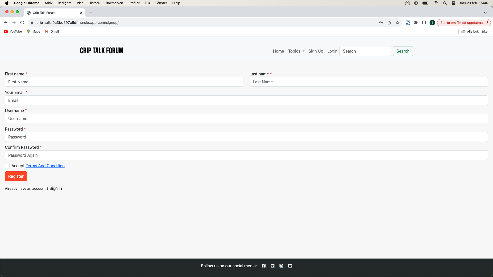
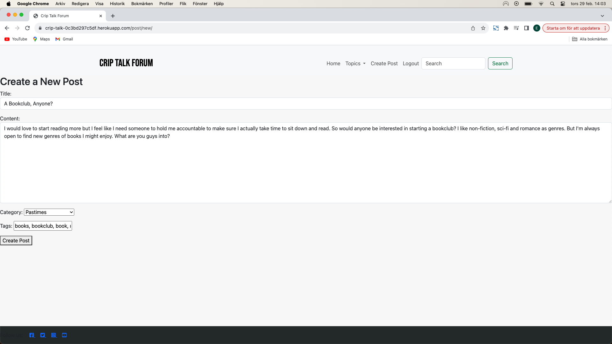
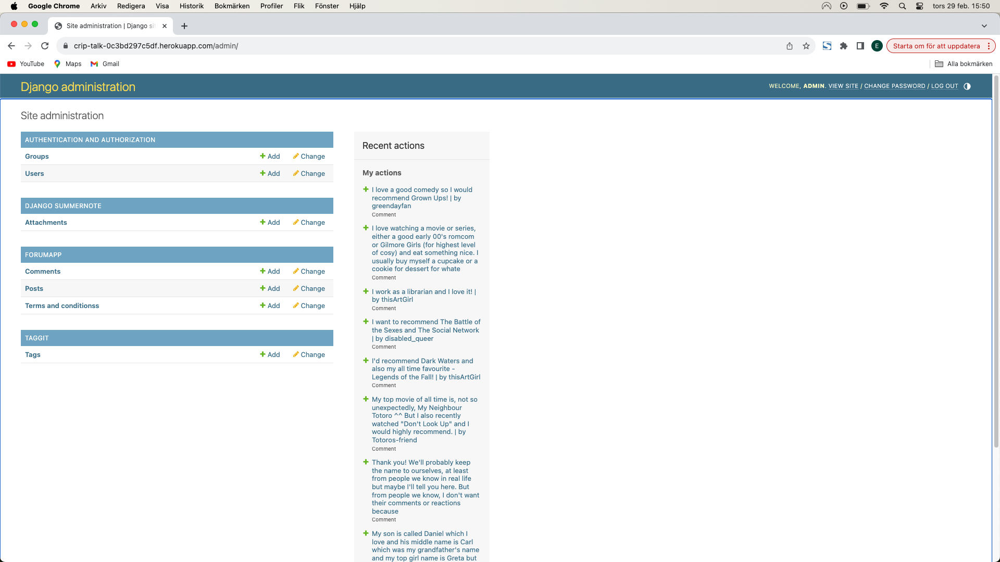
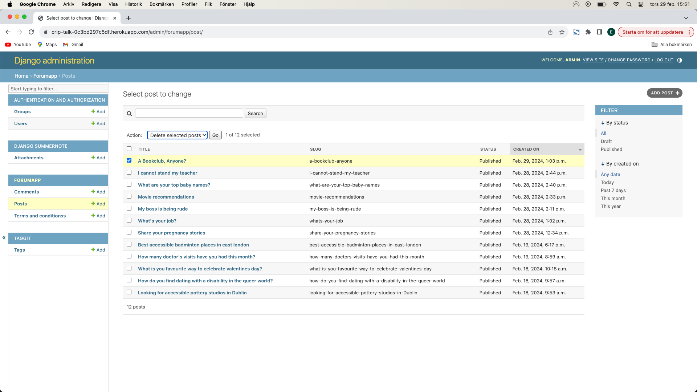
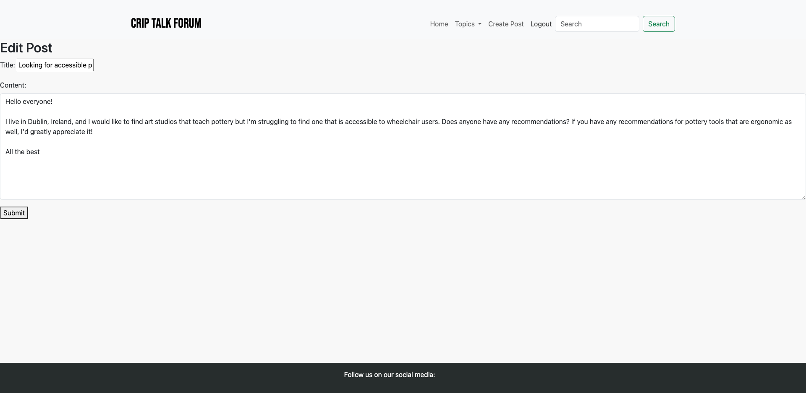
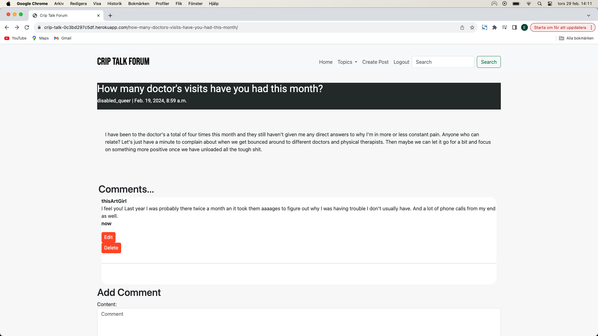
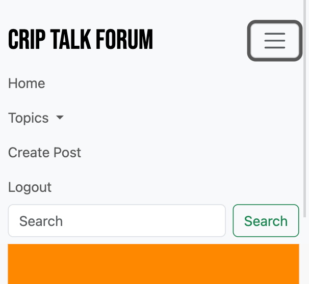

# Manual Testing

The following contents of this document is all the manual testing that has been done in the app. The foundation of the manual testing is in the user stories from the project.

# Table of Contents - User stories
* [Clear Landing Page](#clear-landing-page)
* [Account Registration](#account-registration)
* [Display Topic Tags](#display-topic-tags)
* [Create Thread](#create-thread)
* [Comment on Posts](#comment-on-posts)
* [Admin management](#admin-management)
* [Manage Threads and Comments](#manage-threads-and-comments)
* [Navbar](#navbar)
* [Remove Users](#remove-users)

# Clear Landing Page

# Account Registration

# Display Topics

# Create Thread

# Comment on Posts

# Admin Management

Only the administrator can log into the admin panel.

The administrator can delete posts or comments.

The administrator can also edit posts and comments.

# Manage Threads and Comments

Edit Post

Edit Post

Delete Post

Edit Comment

Edit Comment

Edit Comment

Delete Comment

# Navbar

# Remove Users

If necessary, the administrator can delete user accounts.
